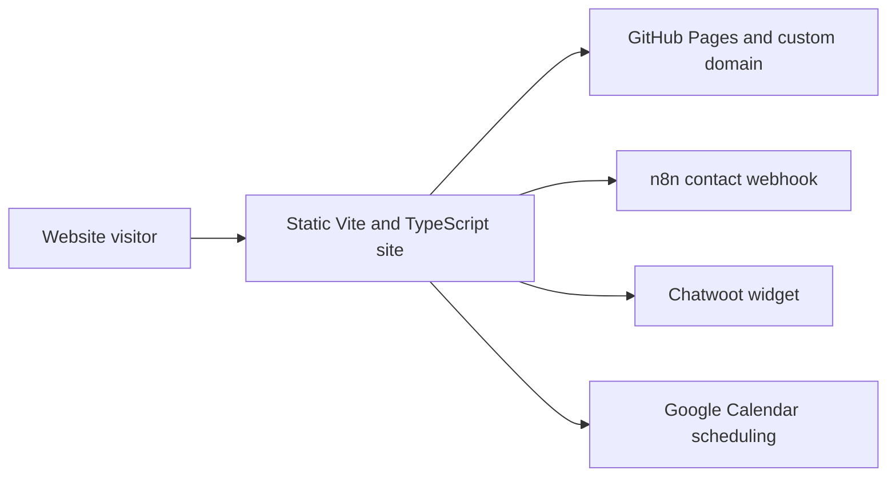

# Autotask Solutions — public website

Source for the public Autotask Solutions marketing site at **[autotasksolutions.site](https://autotasksolutions.site/)**.

> **Status:** actively published through GitHub Pages. This repository documents and renders the website; it is not the source of every automation, AI service or backend described by the marketing content.

## Purpose

The site presents Autotask Solutions, its service categories, team, research directions and contact paths in one public destination. Its job is to help a visitor understand the offer and start a human conversation—not to imply that every listed capability is a packaged or independently verified product.

## Verified website capabilities

The current source implements:

- a static Vite and TypeScript site with no runtime package dependencies;
- multilingual content and a persistent language choice;
- light/dark theme selection and responsive navigation;
- service, research and team sections;
- Google Calendar scheduling;
- a contact form that posts to an n8n webhook;
- an external Chatwoot widget;
- privacy-policy and terms pages;
- GitHub Pages deployment with a custom domain;
- an optional multi-stage Docker/Nginx image.

## Architecture



The n8n workflow, Chatwoot configuration and downstream customer systems are external to this repository.

## Local development

Prerequisites:

- Node.js compatible with Vite 6.

```bash
npm install
npm run dev
```

The current application does **not** consume a Gemini API key. Older AI Studio boilerplate mentioned `GEMINI_API_KEY`, but that instruction does not match the verified source.

These commands are derived from `package.json`; they were not executed during the repository-organization review.

## Deployment

### GitHub Pages

GitHub currently reports:

- source: `gh-pages` branch;
- status: `built`;
- custom URL: [https://autotasksolutions.site/](https://autotasksolutions.site/);
- HTTP verification on 2026-08-07: `200`.

### Docker

The included Dockerfile builds the static site with Node and serves the output with Nginx. No deployment environment is defined inside this repository.

## Trust and data boundaries

The browser sends contact data to a client-visible n8n webhook. Before treating the form as production-grade, verify:

- server-side input validation and payload limits;
- anti-spam and rate limiting;
- data retention, access and deletion rules;
- alignment between collected fields and the published privacy policy;
- monitoring that avoids logging unnecessary personal data;
- explicit success/failure behavior through the real deployed path.

The Chatwoot website token and webhook URL are client-visible identifiers. They must not be relied upon as authorization secrets.

## Marketing evidence boundary

The site describes service and R&D directions. This source repository does not prove delivery status, customer integrations, sales impact, diagnostic effectiveness or ROI for every statement shown on the page.

Quantified claims—including claims about multiplying response rates—must be backed by current, reviewable evidence or rewritten without the unsupported number.

## Verification status

| Area | Current evidence |
|---|---|
| Public website availability | HTTP 200 on 2026-08-07 |
| Pages configuration | `built`, custom domain, `gh-pages` source |
| Source capabilities | Verified by code inspection |
| High-confidence credential scan | No Google/GitHub/AWS keys, JWTs or private keys detected |
| Contact-form E2E | Not verified |
| Chatwoot E2E | Not verified |
| Calendar E2E | Not verified |
| Automated tests/CI | None observed for the source branch |
| Commercial outcomes | Not established by this repository |

## Repository lineage

This is the most complete and recently maintained site in the related landing-page family. The older `Landing-page-AI-Co.` repository should point visitors here before any archival decision.

## Roadmap

1. Verify contact, Chatwoot and scheduling through the live site.
2. Protect and monitor the public contact endpoint.
3. Reconcile privacy/terms text with actual data processing.
4. Replace unsupported quantitative claims with evidence-backed wording.
5. Add automated link, accessibility and deployment smoke checks.
6. Add an explicit repository license.
7. Document the older landing as historical and decide whether its Pages site should remain online.

## License

No repository-level license is currently declared. All rights remain with the repository owner unless a license is added.
